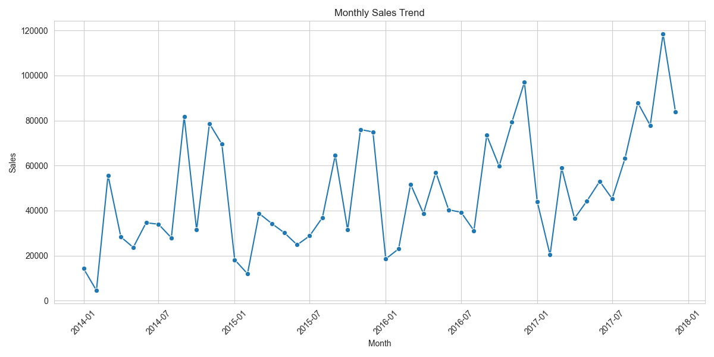
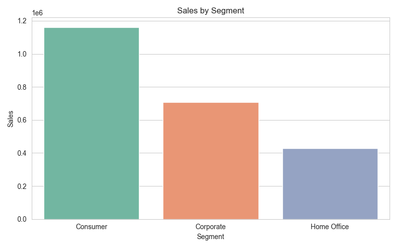
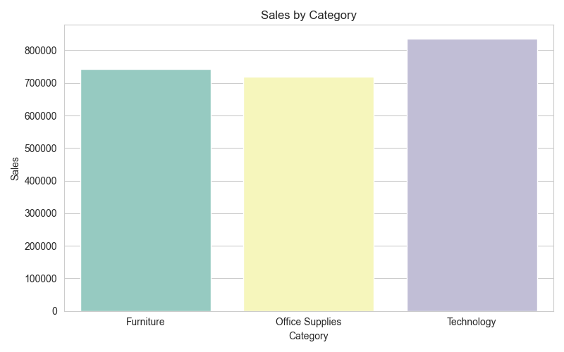
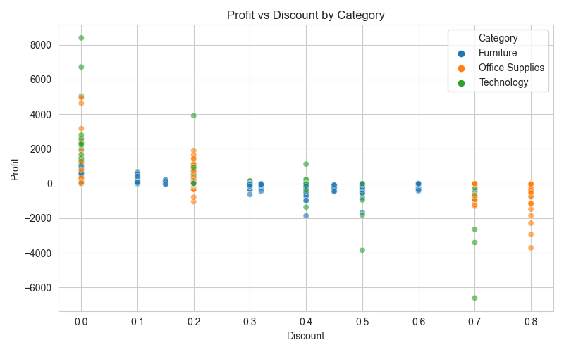
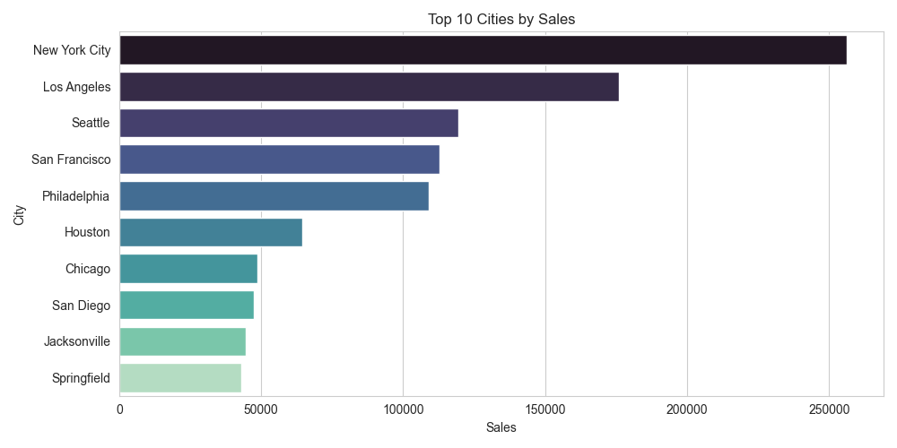

# 🛍️ Retail Sales Forecasting

This project demonstrates an end-to-end pipeline for forecasting retail sales using Python. It includes data cleaning, exploratory data analysis (EDA), time series modeling, and forecasting future sales using ARIMA and Prophet models.

## 📊 Project Highlights

- Cleaned and prepared sales data from a retail dataset
- Performed deep Exploratory Data Analysis (EDA)
- Visualized monthly trends, category performance, and customer segments
- Built time series models (ARIMA, Prophet) for forecasting
- Compared model performances and visualized forecasts

---

## 📁 Folder Structure
retail-sales-forecasting/
│
├── data/ # Raw and processed data
│ └── retail_sales_full.csv
│
├── notebooks/
│ └── retail_sales_forecasting.ipynb # Main analysis notebook
│ └── images/ # Auto-saved plots
│ ├── profit_vs_discount.png
│ ├── sales_by_category.png
│ ├── sales_by_sagment.png
│ └── top_10_cities.png
│
├── reports/
│ └── executive_summary.md # Final report and insights
│
├── .gitignore
├── README.md
└── requirements.txt

---

## 🔧 Tech Stack

- Python 3.9.13
- Jupyter Notebook
- Pandas, NumPy, Matplotlib, Seaborn
- Statsmodels (ARIMA)
- Prophet (for time series forecasting)

---

## 📈 Sample Visualizations

## 📈 Monthly Sales Trend


## 📊 Sales by Segment


## 🗂️ Sales by Category


## 💸 Profit vs Discount


## 🏙️ Top 10 Cities


## 🧠 Executive Summary

The executive summary containing key insights and recommendations can be found [here](reports/executive_summary.md).

---

## 🚀 How to Run

1. Clone the repository  
   ```bash
   git clone https://github.com/yourusername/retail-sales-forecasting.git
   cd retail-sales-forecasting
